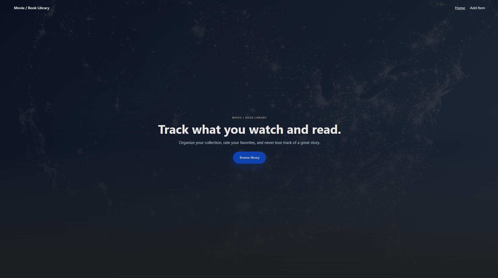
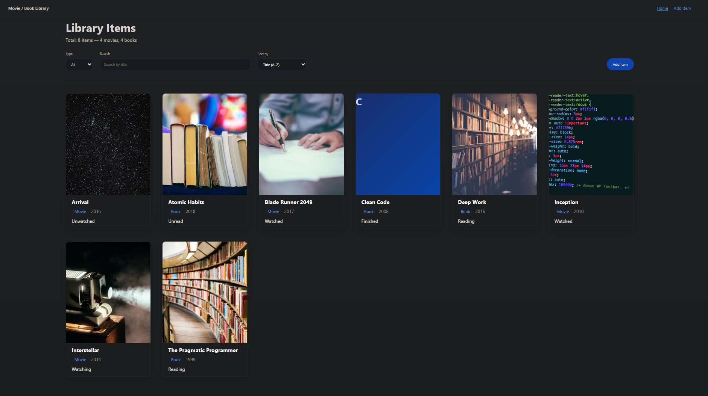

# Movie / Book Library

A full-stack application demonstrating a RESTful .NET Web API with layered architecture, used to manage a personal library of movies and books.

## 🚀 Live Demo

-   **Frontend:** [https://movie-book-library.vercel.app](https://movie-book-library.vercel.app)
-   **API:** [https://movie-book-library.onrender.com](https://movie-book-library.onrender.com)

## 🏗️ Architecture

### Project Structure
```
movie-book-library/
├── api/                    # .NET Web API backend
│   ├── Controllers/        # API endpoints
│   ├── Data/              # DbContext
│   ├── Dtos/              # Data transfer objects
│   ├── Migrations/        # EF Core migrations
│   ├── Models/            # Domain entities
│   ├── Repositories/      # Data access layer
│   └── Services/          # Business logic
└── client/                # React frontend
     └── src/
        ├── api/          # API helper functions
        ├── components/   # Reusable UI components
        └── pages/        # Page components
```

### Infrastructure

-   **Frontend:** Vercel, built from the `client` folder using Vite
-   **Backend:** Docker image deployed on Render
-   **Database:** SQLite + EF Core migrations (auto-applied on container startup)
-   **Environment Variables:** VITE_API_URL configured in Vercel

## 🛠️ Tech Stack

### Backend
- .NET 8 (ASP.NET Core Web API)
- Entity Framework Core
- SQLite
- Swagger / OpenAPI

### Frontend
- React
- Vite
- React Router
- JavaScript

## 📸 Screenshots




## ✨ Key Features

- RESTful CRUD API for managing movies and books
- Layered architecture (Controllers, Services, Repositories)
- Search, filtering, and sorting support
- Persistent storage with EF Core
- Seeded development data

## 🔌 API Endpoints

-   `GET /api/libraryitems` - Get all items (optional `?type=movie` or `?type=book` filter)
-   `GET /api/libraryitems/{id}` - Get item by ID
-   `POST /api/libraryitems` - Create new item
-   `PUT /api/libraryitems/{id}` - Update existing item
-   `DELETE /api/libraryitems/{id}` - Delete item

## 🚀 Getting Started

### Prerequisites

-   [.NET 8 SDK](https://dotnet.microsoft.com/download/dotnet/8.0)
-   [Node.js](https://nodejs.org/) (v18 or later)
-   [npm](https://www.npmjs.com/) (comes with Node.js)

### Database Setup

1. Navigate to the `api` directory:
```bash
    cd api
```

2. Apply database migrations to create the SQLite database:
```bash
    dotnet ef database update
```

    This will create `library.db` with the necessary tables and seed initial data.

### Running the Application

#### Backend (API)

1. From the `api` directory:
```bash
    dotnet run
```

2. The API will be available at:
    - `http://localhost:5000` (HTTP)
    - `https://localhost:5001` (HTTPS)
    - Swagger UI: `https://localhost:5001/swagger`

#### Frontend (Client)

1. Navigate to the `client` directory:
```bash
    cd client
```

2. Install dependencies (first time only):
```bash
    npm install
```

3. Start the development server:
```bash
    npm run dev
```

4. Open your browser and navigate to the URL shown in the terminal (typically `http://localhost:5173`)

## 📄 License

This project is open source and available for personal and educational use.
